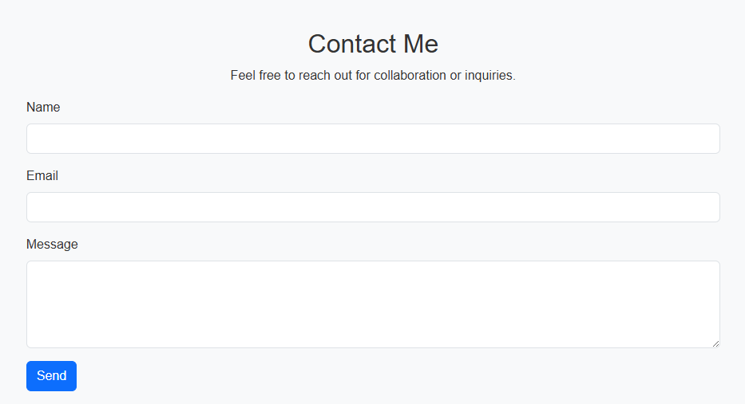

# My Personal Portfolio

 <!-- Add a screenshot here -->

## Project Description
This is a responsive personal portfolio website built using **HTML**, **CSS**, and **Bootstrap 5**. It showcases my skills, education, projects, and contact information. The website is designed with a modern and clean layout, ensuring a great user experience on both desktop and mobile devices.

## Features
- **Responsive Design:** Mobile-first approach with Bootstrap Grid and Flexbox.
- **Navigation Bar:** Includes links to Home, Education, Skills, Projects, and Contact sections.
- **Sidebar:** Displays profile details on desktop and collapses on mobile.
- **Skills Section:** Animated progress bars for skill levels.
- **Projects Section:** Cards with hover effects to showcase major projects.
- **Education Section:** Fancy Bootstrap table with `.table-striped` and `.table-dark` classes.
- **Contact Form:** Includes Bootstrap validation and success/failure alerts.

## Screenshots
Here are some screenshots of the website:

### Home Section
 <!-- Add a screenshot of the home section -->

### Skills Section
 <!-- Add a screenshot of the skills section -->

### Projects Section
 <!-- Add a screenshot of the projects section -->

### Education Section
 <!-- Add a screenshot of the education section -->

### Contact Section
 <!-- Add a screenshot of the contact section -->

## Live Demo
Check out the live demo of the portfolio: [Live Demo](https://your-username.github.io/portfolio-2025)

## Technologies Used
- **HTML5:** For structuring the website.
- **CSS3:** For custom styling and animations.
- **Bootstrap 5:** For responsive design and pre-built components.
- **JavaScript:** For form validation and animations.

## Setup Instructions
To run this project locally, follow these steps:

1. **Clone the Repository:**
   ```bash
   git clone https://github.com/your-username/portfolio-2025.git
